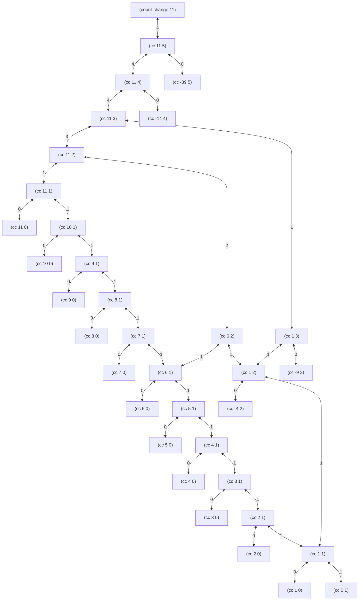

# Exercise 1.14



With respect to the amount being changed, the order of growth of space for `count-change` is $\Theta(n)$, as the call
graph never exceeds $n$ layers.

To determine the order of growth of steps for `count-change`, we can analyze the following recurrence relation:

```math
T(n, k) = T(n, k - 1) + T(n - f(k), k)
```

In this relation, $n$ is the amount being changed, $k$ is the kinds of coins, and $f$ is the mapping between kinds of
coins and the value of the first denomination.

For $k = 1$, we can see:

```math
\begin{align*}

T(n, 1) &= T(n, 0) + T(n - 1, 1) \\[2ex]

&= 1 + T(n - 1, 1) \\[2ex]

&= \Theta(n)

\end{align*}
```

For $k = 2$:

```math
\begin{align*}

T(n, 2) &= T(n, 1) + T(n - 5, 2) \\[2ex]

&= \Theta(n) + T(n - 5, 2) \\[2ex]

&= \Theta(n^2)

\end{align*}
```

For $k = 3$:

```math
\begin{align*}

T(n, 3) &= T(n, 2) + T(n - 10, 3) \\[2ex]

&= \Theta(n^2) + T(n - 10, 3) \\[2ex]

&= \Theta(n^3)

\end{align*}
```

For $k = 4$:

```math
\begin{align*}

T(n, 4) &= T(n, 3) + T(n - 25, 4) \\[2ex]

&= \Theta(n^3) + T(n - 25, 4) \\[2ex]

&= \Theta(n^4)

\end{align*}
```

And finally, for $k = 5$:

```math
\begin{align*}

T(n, 5) &= T(n, 4) + T(n - 50, 5) \\[2ex]

&= \Theta(n^4) + T(n - 50, 5) \\[2ex]

&= \Theta(n^5)

\end{align*}
```

Therefore, the order of growth of number of steps for `count-change` is $\Theta(n^5)$.
