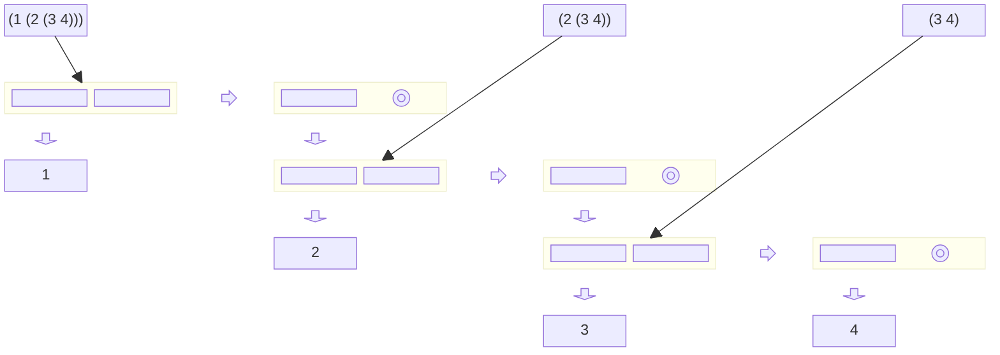
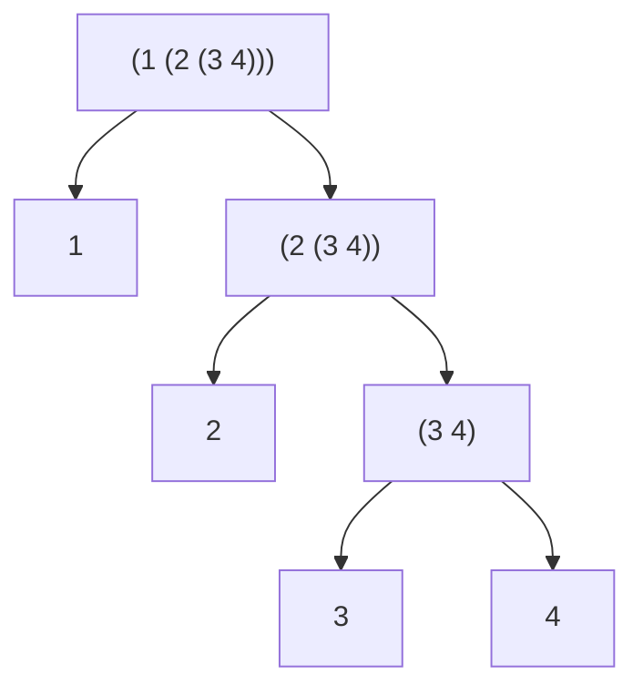

# Exercise 2.24

## Display

```scm
(1 (2 (3 4)))
```

## Box and Pointer


```mermaid
block
    columns 11

    list1["(1 (2 (3 4)))"]
    space:5
    list2["(2 (3 4))"]
    space:3
    list3["(3 4)"]

    space:11

    block:pair1:2
        node1[" "]
        node2[" "]
    end
    list1 --> pair1
    arrow1<[" "]>(right)
    block:pair2:2
        node3[" "]
        node4(((" ")))
    end
    space:6

    arrow2<[" "]>(down)
    space:2
    arrow3<[" "]>(down)
    space:7

    1
    space:2
    block:pair3:2
        node5[" "]
        node6[" "]
    end
    list2 --> pair3
    arrow4<[" "]>(right)
    block:pair4:2
        node7[" "]
        node8(((" ")))
    end
    space:3

    space:3
    arrow5<[" "]>(down)
    space:2
    arrow6<[" "]>(down)
    space:4

    space:3
    2
    space:2
    block:pair5:2
        node9[" "]
        node10[" "]
    end
    list3 --> pair5
    arrow7<[" "]>(right)
    block:pair6:2
        node11[" "]
        node12(((" ")))
    end

    space:6
    arrow8<[" "]>(down)
    space:2
    arrow9<[" "]>(down)
    space

    space:6
    3
    space:2
    4
```

## Tree


```mermaid
flowchart TD
    list1["(1 (2 (3 4)))"]

    list1 --> 1
    list2["(2 (3 4))"]
    list1 --> list2

    list2 --> 2
    list3["(3 4)"]
    list2 --> list3

    list3 --> 3
    list3 --> 4
```
